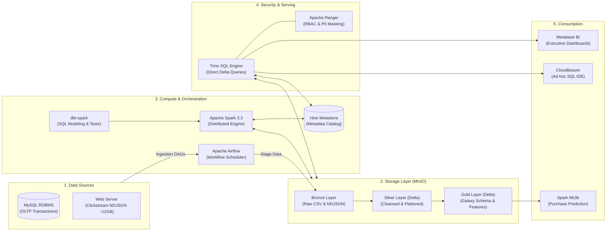

<div align="center">

# 🛒 Modern E-Commerce Data Lakehouse Platform
### Enterprise-Grade Lakehouse Architecture with Medallion Pattern, Delta Lake, Apache Spark, Trino, dbt, Apache Airflow, Apache Ranger, Metabase & Spark MLlib

[](https://opensource.org/licenses/MIT)
[](https://www.python.org/)
[](https://spark.apache.org/)
[](https://delta.io/)
[](https://trino.io/)
[](https://www.getdbt.com/)
[](https://airflow.apache.org/)
[](https://min.io/)
[](https://ranger.apache.org/)
[](https://www.metabase.com/)
[](https://www.docker.com/)
[](https://kubernetes.io/)

**Author:** [Dung Tran](https://github.com/dungtran174) &nbsp;|&nbsp; **Repository:** [ecommerce-lakehouse-platform](https://github.com/dungtran174/ecommerce-lakehouse-platform)

</div>

---

## 📖 Table of Contents

- [Overview & Business Motivation](#-overview--business-motivation)
- [System Architecture](#-system-architecture)
- [Medallion Data Lakehouse Design](#-medallion-data-lakehouse-design)
- [Key Features & Capabilities](#-key-features--capabilities)
- [Technology Stack](#-technology-stack)
- [Repository Structure](#-repository-structure)
- [Getting Started](#-getting-started)
  - [Prerequisites](#prerequisites)
  - [Local Development (Docker Compose)](#local-development-docker-compose)
  - [Running Data Pipelines](#running-data-pipelines)
- [Data Governance & Security](#-data-governance--security)
- [Business Intelligence & Dashboards](#-business-intelligence--dashboards)
- [Machine Learning: Purchase Prediction](#-machine-learning-purchase-prediction)
- [Project Roadmap](#-project-roadmap)
- [References](#-references)

---

## 🎯 Overview & Business Motivation

Modern e-commerce enterprises face immense challenges when extracting value from high-velocity, heterogeneous data streams:
1. **Diverse Data Silos:** High-value relational transactional records (orders, inventory, payment methods, customer tiers) coexist alongside high-volume, semi-structured behavioral clickstream events (search terms, product impressions, cart updates, UTM campaign traffic).
2. **Limitations of Traditional Data Warehouses:** High storage costs, proprietary lock-in, rigid "schema-on-write" rules, and difficulty scaling to handle terabytes of semi-structured JSON clickstream data.
3. **Pitfalls of Traditional Data Lakes:** Lack of ACID transaction guarantees, data reliability degradation ("data swamp"), inability to perform fine-grained updates or deletions (GDPR compliance), and slow query performance for Business Intelligence.

### The Solution: An Open Data Lakehouse
This platform implements an end-to-end **Data Lakehouse** architecture unifying batch and clickstream analytical processing over **Delta Lake** and **MinIO (S3-compatible)** object storage:
- **Single Source of Truth:** Unifies raw storage and dimensional modeling without duplicating data between separate lake and warehouse engines.
- **ACID Reliability:** Provides snapshot isolation, ACID transactions, and schema enforcement using Delta Lake.
- **Enterprise Governance:** Enforces fine-grained Role-Based Access Control (RBAC) and PII data masking using **Apache Ranger** via Trino.
- **End-to-End Automation:** Orchestrates ingestion, multi-layer dbt modeling, data quality testing, machine learning inference, and BI reporting with **Apache Airflow**.

---

## 🏗 System Architecture

The platform separates compute from storage across five distinct architectural layers:



For complete technical specifications, see [docs/architecture.md](docs/architecture.md).

---

## 🥉🥈🥇 Medallion Data Lakehouse Design

Data progresses through three quality tiers inside the Lakehouse:

| Layer | Storage & Format | Data Entities & Tables | Processing Objectives |
| :--- | :--- | :--- | :--- |
| **Bronze** | MinIO `lakehouse/bronze/`<br>Raw CSV & NDJSON | - `customers_snapshot.csv`<br>- `products_snapshot.csv`<br>- `brands_snapshot.csv`<br>- `category_snapshot.csv`<br>- `payment_method_snapshot.csv`<br>- `orders_{yyyymmdd}.csv`<br>- `order_items_{yyyymmdd}.csv`<br>- `part_{xxxx}.ndjson` (Clickstream) | Raw, immutable landing zone. Preserves full historical fidelity and audit lineage directly from source extraction. |
| **Silver** | MinIO `lakehouse/silver/`<br>**Delta Lake** (Parquet) | - `silver.customer`<br>- `silver.products`<br>- `silver.brands`<br>- `silver.category`<br>- `silver.payment_method`<br>- `silver.orders`<br>- `silver.order_items`<br>- `silver.user_sessions` *(Partitioned by Y/M/D)*<br>- `silver.session_actions` *(Partitioned by Y/M/D)* | Cleansed, strongly typed, and deduplicated conformed tables. Flattens nested JSON payloads, sanitizes PII, and applies ACID guarantees. |
| **Gold** | MinIO `lakehouse/gold/`<br>**Delta Lake** (Parquet) | **Sale Mart (Kimball Galaxy Schema):**<br>- `sale_mart.dim_customer`<br>- `sale_mart.dim_product`<br>- `sale_mart.dim_date`<br>- `sale_mart.dim_payment_method` *(SCD2)*<br>- `sale_mart.fact_order`<br>- `sale_mart.fact_order_items`<br>**ML & Marketing Marts:**<br>- `ml.user_behavior_3d_agg_feature`<br>- `marketing.high_value_purchase_campaign` | Production analytical data marts optimized for executive BI dashboards, ad-hoc OLAP exploration, and rolling 3-day ML feature stores. |

Detailed field definitions and constraints are documented in [docs/data_dictionary.md](docs/data_dictionary.md).

---

## 🚀 Key Features & Capabilities

- **Delta Lake ACID Transactions:** Eliminates partial-write corruptions during pipeline failures; supports concurrent read/writes.
- **Time Travel & Data Auditing:** Query historical snapshots of customer profiles and catalog states.
- **Distributed Query Federation with Trino:** Query Delta Lake tables at scale without requiring proprietary data warehouse licenses.
- **Centralized Security Governance:** Column-level data masking (e.g., masking customer phone numbers and emails) and table access control using Apache Ranger.
- **Modular Data Modeling with dbt:** Declarative transformations, automated testing (`unique`, `not_null`, foreign keys), and complete documentation generation.
- **Behavioral Feature Engineering & Machine Learning:** End-to-end Spark MLlib classification pipeline predicting customer conversion probability from clickstream interactions.
- **Dual Deployment Options:** Full local evaluation via Docker Compose and production cloud deployment via Kubernetes manifests and Helm charts.

---

## 🛠 Technology Stack

| Layer | Technology | Purpose |
| :--- | :--- | :--- |
| **Storage** | [MinIO](https://min.io/) | High-performance, S3-compatible distributed object storage |
| **Table Format** | [Delta Lake 2.2](https://delta.io/) | Open-source storage layer enabling ACID transactions on Parquet |
| **Metadata Catalog**| [Apache Hive Metastore 3.0](https://hive.apache.org/) | Centralized schema registry for Delta Lake tables |
| **Compute Engine** | [Apache Spark 3.3](https://spark.apache.org/) | Distributed in-memory data processing & MLlib engine |
| **Transformation** | [dbt-spark 1.7](https://www.getdbt.com/) | Data transformation and testing workflow using SQL |
| **Orchestration** | [Apache Airflow 2.7](https://airflow.apache.org/) | DAG-based workflow scheduling and dependency management |
| **Query Engine** | [Trino](https://trino.io/) | Fast distributed SQL query engine for interactive analytics |
| **Governance** | [Apache Ranger](https://ranger.apache.org/) | Centralized security, RBAC, and dynamic column masking |
| **BI & Analytics** | [Metabase](https://www.metabase.com/) & [CloudBeaver](https://cloudbeaver.io/) | Business intelligence reporting and web-based SQL exploration |
| **Infrastructure** | [Docker](https://www.docker.com/) & [Kubernetes](https://kubernetes.io/) | Containerization and container orchestration |

---

## 📁 Repository Structure

```
ecommerce-lakehouse-platform/
├── .github/
│   └── workflows/
│       └── ci-lint.yml                  # Automated Python, SQL, and YAML linting
├── airflow/
│   ├── config/                          # Airflow environment configuration
│   ├── dags/                            # Batch ingestion & ML DAGs
│   └── plugins/                         # Custom Airflow operators and hooks
├── bi/
│   ├── metabase/                        # Exported dashboard queries and definitions
│   └── screenshots/                     # Visual dashboard assets
├── data_generators/                     # Synthetic OLTP and clickstream log generators
├── dbt/
│   ├── macros/                          # Custom dbt macros (Delta properties, schemas)
│   ├── models/                          # Staging, Silver, and Gold SQL models
│   └── tests/                           # Schema validations and business assertions
├── docker/                              # Docker Compose stack & custom Dockerfiles
├── docs/                                # Architecture, data dictionary, runbooks
├── k8s/                                 # Kubernetes base manifests, ingress, Helm values
├── ml/                                  # Zeppelin notebooks & PySpark ML pipelines
├── scripts/                             # Automation scripts (MinIO init, bootstrap, tests)
├── Makefile                             # Central developer automation interface
├── requirements.txt                     # Core production dependencies
├── requirements-dev.txt                 # Linting and testing dependencies
└── README.md
```

---

## ⚡ Getting Started

### Prerequisites
- **Docker** (>= 24.0) & **Docker Compose** (>= 2.20)
- **Python** (>= 3.10, <= 3.11)
- **Make** utility

### Local Development (Docker Compose)
1. **Clone the repository:**
   ```bash
   git clone https://github.com/dungtran174/ecommerce-lakehouse-platform.git
   cd ecommerce-lakehouse-platform
   ```

2. **Initialize development environment:**
   ```bash
   make setup
   ```

3. **Start the Lakehouse Docker stack:**
   ```bash
   make docker-up
   ```

4. **Initialize MinIO buckets & storage:**
   ```bash
   make init-lakehouse
   ```

5. **Generate synthetic E-commerce data:**
   ```bash
   make seed-data
   ```

### Running Data Pipelines
- **Apache Airflow UI:** Navigate to `http://localhost:8080` (credentials: `admin` / `admin`).
- Trigger the core DAGs:
  - `oltp_data_pipeline`: Ingests transactional tables, executes dbt Silver/Gold models.
  - `user_activity_logs_pipeline`: Ingests clickstream logs, flattens sessions and actions.
  - `marketing_campaign_ml_pipeline`: Prepares 3-day features, trains Logistic Regression model, scores leads.

---

## 🔒 Data Governance & Security

Using **Apache Ranger** integrated with **Trino**:
- **Role-Based Access Control:** Data Analysts access `sale_mart.*` but are restricted from accessing raw PII marketing data.
- **Dynamic Column Masking:** Customer email addresses and phone numbers are automatically masked (`hash` or `partial-mask`) for unauthorized roles.
- **Comprehensive Auditing:** All read/write attempts to Delta tables are logged for compliance.

---

## 📊 Business Intelligence & Dashboards

Interactive dashboards deployed on **Metabase** connecting directly to **Trino**:
- **Revenue Overview:** Year-over-Year (YoY) revenue and order volume trends.
- **Product & Category Performance:** Top 10 bestselling SKUs by revenue and unit volume.
- **Geographic Sales Analysis:** Regional breakdown of order volumes across Vietnamese provinces.
- **Payment Method Distribution:** Market share of digital wallets (Momo, ZaloPay, ShopeePay) vs COD.

---

## 🤖 Machine Learning: Purchase Prediction

- **Algorithm:** Spark MLlib Logistic Regression with standardized feature vectors.
- **Feature Set:** 3-day rolling window capturing user engagement (`sessions_3d`, `duration`, `page_views`, `actions_per_session`, `cart_conversion_rate`).
- **Target Label:** Binary flag indicating whether the user purchases on day $T+1$.
- **Model Performance:** **AUC-ROC ~ 0.78**, **F1-Score ~ 0.74** on synthetic test cohorts.
- **Business Actionability:** Automatic population of `marketing.high_value_purchase_campaign` with personalized engagement actions (SMS, Push Notification, Email).

---

## 🗺 Project Roadmap

- [x] **Phase 1:** Project initialization, architecture specification, data dictionary, CI/CD linting, Makefile, and README.
- [ ] **Phase 2:** Storage & metadata infrastructure (MinIO distributed cluster, Apache Hive Metastore, Kubernetes manifests).
- [ ] **Phase 3:** Custom Spark Thrift Server container with Delta Lake and AWS S3 connectors.
- [ ] **Phase 4:** High-fidelity synthetic E-Commerce data generators (OLTP relational & Clickstream NDJSON).
- [ ] **Phase 5:** Apache Airflow orchestration platform setup and connection bootstrapping.
- [ ] **Phase 6:** Bronze layer data ingestion pipelines.
- [ ] **Phase 7:** dbt project initialization with Spark adapter and schema contracts.
- [ ] **Phase 8:** Silver layer data cleansing and Delta Lake transformation models.
- [ ] **Phase 9:** Gold layer Kimball Galaxy Schema (Sale Mart) implementation.
- [ ] **Phase 10:** Feature Store engineering and Spark MLlib purchase prediction pipeline.
- [ ] **Phase 11:** Trino serving engine deployment and Apache Ranger security governance.
- [ ] **Phase 12:** Consumption layer setup (Metabase BI dashboards & CloudBeaver).
- [ ] **Phase 13:** End-to-end integration testing, Delta maintenance, and documentation finalization.

---

## 📚 References

1. Armbrust, M., et al. (2020). *Lakehouse: A New Generation of Open Platforms that Unify Data Warehousing and Advanced Analytics*. Proceedings of CIDR 2021.
2. Kimball, R., & Ross, M. (2013). *The Data Warehouse Toolkit: The Definitive Guide to Dimensional Modeling* (3rd ed.). Wiley.
3. Delta Lake Documentation: [https://docs.delta.io/](https://docs.delta.io/)
4. Trino Distributed Query Engine: [https://trino.io/docs/](https://trino.io/docs/)
5. Apache Ranger Architecture: [https://ranger.apache.org/](https://ranger.apache.org/)

---

<div align="center">
Developed by <b>Dung Tran</b> &bull; Star ⭐ this repository if you find it helpful!
</div>
