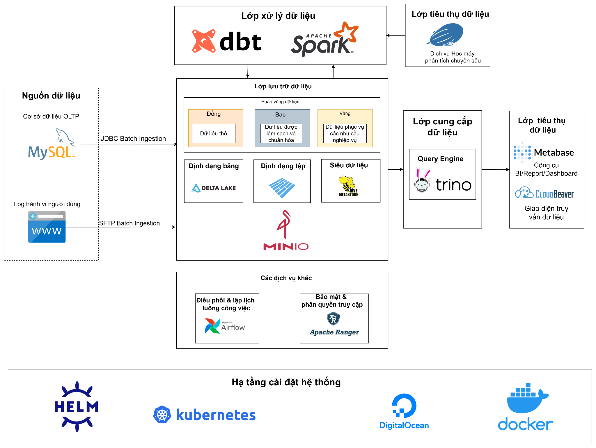

# E-Commerce Data Lakehouse Platform

Hệ thống Data Lakehouse thu thập, lưu trữ, xử lý và phân tích dữ liệu Thương mại điện tử dựa trên kiến trúc Medallion (Bronze → Silver → Gold).

[](https://spark.apache.org/)
[](https://delta.io/)
[](https://trino.io/)
[](https://www.getdbt.com/)
[](https://airflow.apache.org/)
[](https://min.io/)
[](https://ranger.apache.org/)
[](https://www.metabase.com/)
[](https://www.docker.com/)

---

## 1. Giới thiệu & Bài toán giải quyết

### Dự án làm gì?
Xây dựng pipeline dữ liệu Lakehouse từ đầu đến cuối (End-to-End):
- **Thu thập:** Dữ liệu giao dịch từ MySQL (OLTP) và dữ liệu hành vi người dùng clickstream dạng NDJSON (~12GB) từ Web Server qua SFTP.
- **Xử lý:** Làm sạch, chuẩn hóa, mô hình hóa đa chiều (Galaxy Schema) và tạo feature store theo mô hình Medallion (Bronze → Silver → Gold).
- **Phục vụ:** Báo cáo quản trị BI (Metabase qua Trino) và Machine Learning dự đoán khả năng mua hàng của khách hàng (Spark MLlib).

### Giải quyết vấn đề gì?
- **Tránh nghẽn CSDL vận hành (OLTP):** Tách biệt tầng lưu trữ và tính toán phân tích, không chạy query nặng trực tiếp trên MySQL bán hàng.
- **Xử lý linh hoạt dữ liệu bán cấu trúc:** Clickstream JSON lớn được làm phẳng, ép kiểu và lưu dưới định dạng **Delta Lake** (Parquet) có ACID transactions, time travel và tối ưu chi phí lưu trữ trên **MinIO**.
- **Thống nhất nền tảng:** Thay thế mô hình 2 tầng cồng kềnh (Data Lake + Data Warehouse riêng biệt) bằng 1 nền tảng Lakehouse duy nhất phục vụ đồng thời cả BI và AI/ML.
- **Bảo mật tập trung:** Phân quyền truy cập dữ liệu (RBAC) và che mặt nạ (masking) thông tin nhạy cảm (PII) qua **Apache Ranger**.

---

## 2. Kiến trúc hệ thống



- **Storage:** MinIO (Object Storage S3) lưu trữ 3 tầng Bronze (raw), Silver (cleansed Delta Lake), Gold (marts).
- **Metadata:** Hive Metastore quản lý catalog và schema cho Spark và Trino.
- **Processing:** Apache Spark 3.3 (Thrift Server) thực thi các mô hình biến đổi dữ liệu viết bằng **dbt**.
- **Serving:** Trino MPP SQL Engine truy vấn phân tán trực tiếp trên Delta Lake không cần sao chép dữ liệu.
- **Security:** Apache Ranger kiểm soát quyền truy cập và che dữ liệu PII.
- **Consumption:** Metabase (BI Dashboard), CloudBeaver (SQL Client), Apache Zeppelin (Spark MLlib).
- **Orchestration:** Apache Airflow lập lịch tự động hóa toàn bộ pipeline.

---

## 3. Hướng dẫn chạy dự án

### Yêu cầu
- Docker >= 24.0 & Docker Compose >= 2.20
- RAM khuyến nghị: 12GB - 16GB
- Python 3.10+ & Make (tùy chọn)

### Các bước khởi chạy

```bash
# 1. Clone repository
git clone https://github.com/dungtran174/ecommerce-lakehouse-platform.git
cd ecommerce-lakehouse-platform

# 2. Khởi chạy toàn bộ dịch vụ (chờ 2-3 phút để các container sẵn sàng)
make docker-up
# hoặc: docker compose -f docker/docker-compose.yml up -d

# 3. Khởi tạo bucket MinIO
make init-lakehouse
# hoặc: bash scripts/init_minio.sh

# 4. Sinh dữ liệu mẫu (MySQL OLTP & Clickstream Logs)
make seed-data

# 5. Chạy pipeline chuyển đổi dữ liệu với dbt
make dbt-run
make dbt-test
```

> **Lưu ý:** Bạn cũng có thể kích hoạt các DAG tự động trên giao diện Airflow: `oltp_data_pipeline`, `user_activity_logs_pipeline`, `marketing_campaign_ml_pipeline`.

---

## 4. Dịch vụ & Cổng truy cập

| Dịch vụ | URL | Tài khoản mặc định | Ghi chú |
| :--- | :--- | :--- | :--- |
| **Apache Airflow** | `http://localhost:8080` | `admin` / `admin` | Quản lý & lập lịch DAG |
| **MinIO Console** | `http://localhost:9001` | `minioadmin` / `minioadmin` | Quản lý bucket S3 |
| **Metabase** | `http://localhost:3000` | Setup lần đầu | Dashboard phân tích BI |
| **Trino Web UI** | `http://localhost:8085` | `admin` | Giám sát query Trino |
| **CloudBeaver** | `http://localhost:8978` | `cbadmin` / `admin` | Web SQL Client |
| **Apache Ranger** | `http://localhost:6080` | `admin` / `rangeradmin` | Quản lý phân quyền |
| **Apache Zeppelin** | `http://localhost:8082` | - | Notebook Spark ML |
| **Spark Web UI** | `http://localhost:4040` | - | Giám sát Spark Job |

Dừng hệ thống khi không sử dụng:
```bash
make docker-down
```
