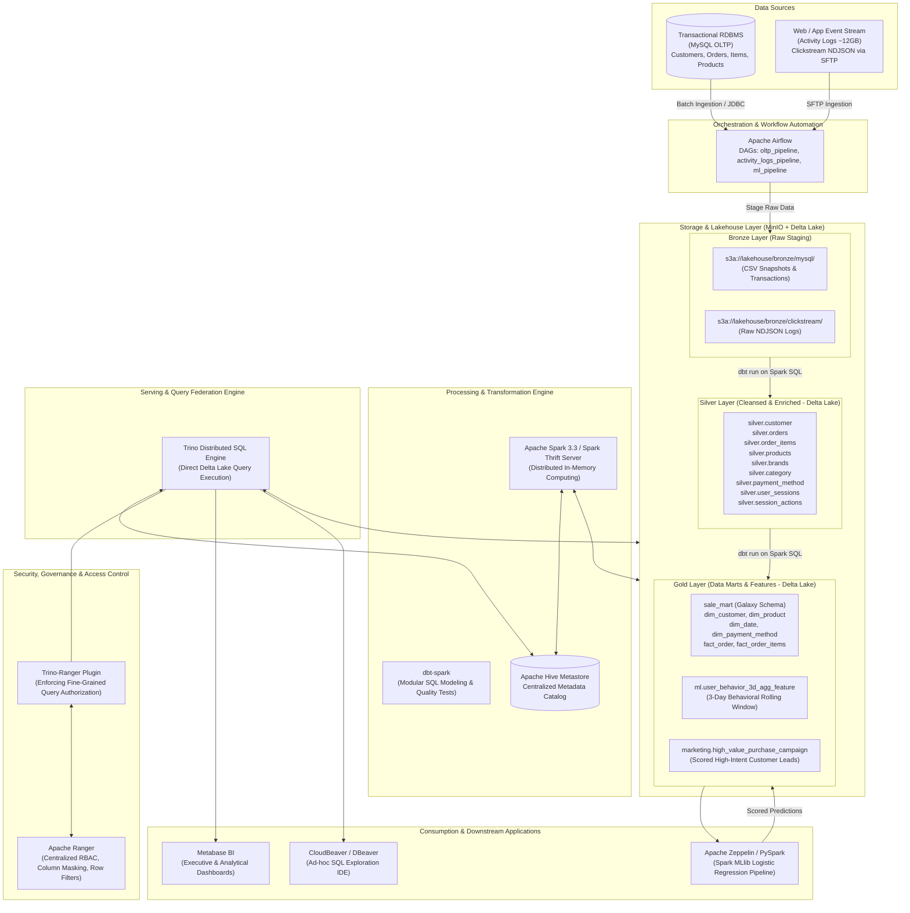

# Modern E-Commerce Data Lakehouse Platform: Architecture & System Design

## 1. Executive Summary

This document outlines the end-to-end architectural blueprint for the **E-Commerce Data Lakehouse Platform**, engineered by **Dung Tran** ([@dungtran174](https://github.com/dungtran174)). 

Modern e-commerce enterprises generate diverse, high-velocity datasets ranging from structured transactional OLTP data (orders, inventory, customer accounts) to semi-structured high-throughput behavioral clickstream logs (page views, search events, cart additions, UTM campaigns). Traditional architectures split data ecosystems into siloed **Data Lakes** (cheap object storage, flexible for unstructured data, but lacking ACID guarantees and slow for BI) and **Data Warehouses** (proprietary, performant SQL engines, but expensive and rigid).

This project implements a unified **Lakehouse Architecture** adopting the **Medallion Architecture (Bronze → Silver → Gold)** pattern. It combines the cost-effectiveness and flexibility of object storage (**MinIO / S3**) with the reliability, ACID transactions, and performance optimizations of **Delta Lake**, powered by **Apache Spark**, **dbt**, **Trino**, **Apache Ranger**, **Apache Airflow**, and **Metabase**.

---

## 2. High-Level Architecture Diagram

---

## 3. Core Architectural Components

### 3.1 Storage Layer: MinIO & Delta Lake
- **Object Storage (MinIO):** Distributed S3-compliant object store offering high durability, horizontal scalability, and multi-tenant isolation. Buckets are segregated logically into `lakehouse/bronze`, `lakehouse/silver`, `lakehouse/gold`, `lakehouse/logs`, and `lakehouse/models`.
- **Table Format (Delta Lake 2.x):** Sits directly on top of Parquet files in MinIO, providing:
  - **ACID Transactions:** Serializable isolation level via append-only commit logs (`_delta_log/*.json`).
  - **Schema Enforcement & Evolution:** Prevents bad records from corrupting production tables while allowing graceful schema updates.
  - **Time Travel & Versioning:** Historical snapshot querying for auditing and reproducibility.
  - **Compaction & Z-Ordering:** Eliminates small file bottlenecks and dramatically speeds up multidimensional analytical queries.

### 3.2 Metadata Management: Apache Hive Metastore (HMS)
- Centralized catalog mapping Delta Lake physical paths and Parquet schemas to logical databases and tables (`silver.*`, `sale_mart.*`, `ml.*`, `marketing.*`).
- Backed by an external MySQL database for persistent relational catalog storage.

### 3.3 Compute & Data Transformation: Apache Spark & dbt
- **Apache Spark (v3.3):** Distributed computing engine providing scalable data processing. Deployed as a containerized **Spark Thrift Server**, enabling external tools (such as dbt) to submit distributed SQL workloads over JDBC/ODBC.
- **dbt (data build tool):** Orchestrates all transformations from Bronze to Silver and Gold using declarative SQL:
  - Materializes models as managed Delta tables.
  - Enforces schema contracts and data documentation.
  - Executes automated data quality tests (`unique`, `not_null`, `relationships`, and custom business rule assertions).

### 3.4 Serving Engine: Trino
- Distributed MPP (Massively Parallel Processing) SQL query engine.
- Decoupled from compute and storage: Trino reads metadata from Hive Metastore and queries Delta Parquet files directly from MinIO without copying data.
- Provides interactive, low-latency SQL responses for BI dashboards and data analysts.

### 3.5 Security & Data Governance: Apache Ranger
- Centralized security administration for authentication and authorization.
- **Trino-Ranger Plugin:** Enforces:
  - **Role-Based Access Control (RBAC):** Restricting sensitive databases (e.g., `marketing` campaign data) to authorized user groups.
  - **Column Masking:** Masking Personally Identifiable Information (PII) such as customer phone numbers and email addresses for general analytical personas.
  - **Audit Logging:** Comprehensive audit trails of all access attempts and query operations.

### 3.6 Orchestration: Apache Airflow
- Automated workflow scheduler managing data pipelines with dependency management and retry semantics:
  1. `oltp_data_pipeline`: Extracts transactional data from MySQL, writes to Bronze CSV, compiles dbt, builds Silver and Gold Sale Mart tables, and triggers validation tests.
  2. `user_activity_logs_pipeline`: Connects to web log servers via SFTP, transfers NDJSON files to Bronze, flattens clickstreams into Silver sessions and actions, and populates feature sets.
  3. `marketing_campaign_ml_pipeline`: Coordinates ML feature preparation, model inference, and population of targeted marketing campaigns.

### 3.7 Consumption & Machine Learning Layer
- **Metabase:** Enterprise BI web application delivering operational dashboards (sales velocity, regional revenue distribution, customer loyalty metrics, payment method adoption).
- **CloudBeaver:** Web-based database management interface connected to Trino JDBC for ad-hoc analytical queries.
- **Spark MLlib & Zeppelin Notebook:**
  - Machine learning pipeline utilizing **Logistic Regression** to predict next-day customer purchase probability based on rolling 3-day user engagement patterns.
  - Automated generation of actionable customer segmentation (`Hot Leads`, `Medium Intent`, `Low Intent`) for marketing automation.

---

## 4. Medallion Data Flow Breakdown

| Layer | Ingestion Source | Storage Format | Schema / Tables | Primary Objective |
| :--- | :--- | :--- | :--- | :--- |
| **Bronze** | MySQL (JDBC) & Web Logs (SFTP) | Raw CSV & Raw NDJSON | Unstructured / semi-structured files in `s3a://lakehouse/bronze/` | Preserve exact, raw historical data lineage. Immutable landing zone. |
| **Silver** | Bronze Layer | Delta Lake (Snappy Parquet) | `silver.customer`, `silver.orders`, `silver.order_items`, `silver.products`, `silver.brands`, `silver.category`, `silver.payment_method`, `silver.user_sessions`, `silver.session_actions` | Cleansed, typed, deduplicated, and flattened tabular structures with Delta ACID protection. |
| **Gold** | Silver Layer | Delta Lake (Snappy Parquet) | **Sale Mart (Kimball Galaxy Schema):** - `dim_customer`, `dim_product`, `dim_date`, `dim_payment_method` (SCD Type 2) - `fact_order`, `fact_order_items` **ML Mart:** `ml.user_behavior_3d_agg_feature` **Marketing Mart:** `marketing.high_value_purchase_campaign` | Production data marts optimized for analytical reporting, executive BI, and predictive AI/ML models. |

---

## 5. Deployment Topology

The platform supports dual deployment configurations:
1. **Local Development (Docker Compose):** A unified multi-container stack with custom Docker images, dedicated network bridges, and local persistent volumes. Ideal for evaluation, development, and portfolio demonstrations.
2. **Production / Cloud Infrastructure (Kubernetes & Helm):**
   - **MinIO:** StatefulSet with 2 replicas backed by persistent block storage (`PV / PVC`).
   - **Hive Metastore:** Containerized deployment connected to backend metadata database.
   - **Spark Thrift Server:** Scalable deployment with worker pods.
   - **Trino:** Coordinator-Worker topology for distributed MPP query execution.
   - **Ingress Controller:** Nginx Ingress routing hostnames (`console.minio.lakehouse.local`, `airflow.lakehouse.local`, `metabase.lakehouse.local`, `cloudbeaver.lakehouse.local`).

---

## 6. References & Literature

1. Armbrust, M., Ghodsi, A., Xin, R., & Zaharia, M. (2020). *Lakehouse: A New Generation of Open Platforms that Unify Data Warehousing and Advanced Analytics*. Proceedings of the VLDB Endowment (CIDR 2021).
2. Kimball, R., & Ross, M. (2013). *The Data Warehouse Toolkit: The Definitive Guide to Dimensional Modeling* (3rd ed.). Wiley.
3. Delta Lake Documentation & ACID Specifications: [https://docs.delta.io/](https://docs.delta.io/)
4. Apache Spark Programming Guide: [https://spark.apache.org/docs/latest/](https://spark.apache.org/docs/latest/)
5. Trino Distributed SQL Engine: [https://trino.io/docs/current/](https://trino.io/docs/current/)
6. Apache Ranger Security Architecture: [https://ranger.apache.org/](https://ranger.apache.org/)
