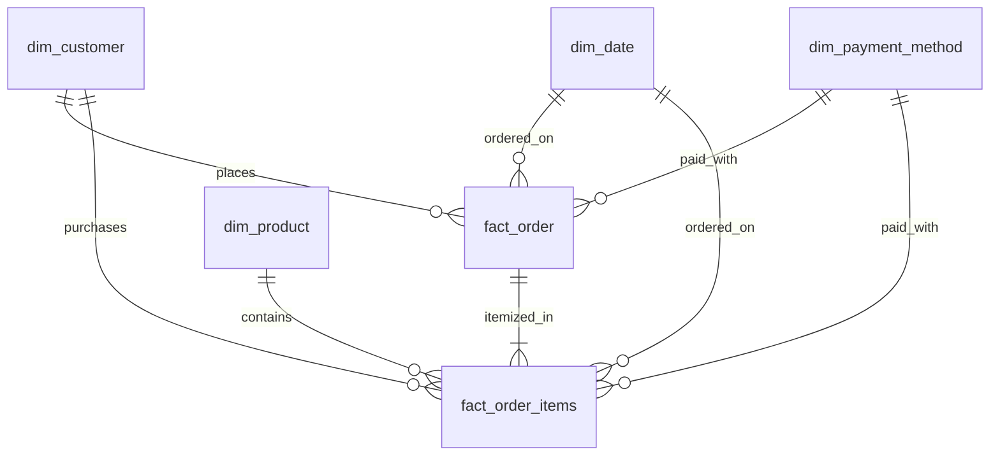

# Data Dictionary & Schema Specifications

This document defines the comprehensive data models, column definitions, data types, constraints, and business context across the **Bronze**, **Silver**, and **Gold** layers of the **E-Commerce Data Lakehouse Platform**.

---

## 1. Source Systems & Bronze Layer

The **Bronze Layer** acts as an append-only, immutable staging zone storing raw data in its native format on **MinIO (S3-compatible storage)** under bucket `lakehouse/bronze/`.

### 1.1 Source 1: Relational OLTP Database (MySQL)
Batch snapshots and incremental transaction logs extracted via JDBC and landed as CSV files.

#### 1. `customers` (Snapshot)
- **Landing Path:** `s3a://lakehouse/bronze/mysql/customers_snapshot.csv`
- **Volume:** ~100,000 records (12 MB)

| Column Name | Raw Type | Constraints | Description |
| :--- | :--- | :--- | :--- |
| `customer_id` | INT | Primary Key | Unique customer identifier |
| `first_name` | VARCHAR(50) | Not Null | Customer's first name |
| `last_name` | VARCHAR(50) | Not Null | Customer's last name |
| `email` | VARCHAR(100) | Nullable | Customer contact email address |
| `phone_number` | VARCHAR(20) | Nullable | Mobile contact number |
| `gender` | VARCHAR(10) | Nullable | Gender (`Nam`, `Nữ`, `Other`) |
| `tire` | VARCHAR(20) | Not Null | Loyalty tier (`Bronze`, `Silver`, `Gold`, `Platinum`) |
| `address` | VARCHAR(100) | Nullable | Primary shipping province / city |
| `created_at` | TIMESTAMP | Not Null | Account creation timestamp |
| `updated_at` | TIMESTAMP | Nullable | Profile update timestamp |

#### 2. `brands` (Snapshot)
- **Landing Path:** `s3a://lakehouse/bronze/mysql/brands_snapshot.csv`
- **Volume:** ~2,000 records (62 KB)

| Column Name | Raw Type | Constraints | Description |
| :--- | :--- | :--- | :--- |
| `brand_id` | VARCHAR(50) | Primary Key | Unique brand identifier |
| `brand_name` | VARCHAR(100) | Not Null | Commercial brand name |
| `brand_origin` | VARCHAR(50) | Nullable | Country of brand origin |

#### 3. `category` (Snapshot)
- **Landing Path:** `s3a://lakehouse/bronze/mysql/category_snapshot.csv`
- **Volume:** 20 records (3 KB)

| Column Name | Raw Type | Constraints | Description |
| :--- | :--- | :--- | :--- |
| `category_id` | INT | Primary Key | Unique category identifier |
| `category_display_name` | VARCHAR(50) | Not Null | Display name of product category |
| `category_description` | VARCHAR(255) | Nullable | Detailed category description |

#### 4. `products` (Snapshot)
- **Landing Path:** `s3a://lakehouse/bronze/mysql/products_snapshot.csv`
- **Volume:** ~1,000 records (209 KB)

| Column Name | Raw Type | Constraints | Description |
| :--- | :--- | :--- | :--- |
| `product_id` | INT | Primary Key | Unique product SKU identifier |
| `product_name` | VARCHAR(100) | Not Null | Product title |
| `product_description` | VARCHAR(255) | Nullable | Marketing description |
| `price` | DECIMAL(10,2) | Not Null | Base listing price in VND |
| `category_id` | INT | FK -> category | Category foreign key |
| `brand_id` | VARCHAR(50) | FK -> brands | Brand foreign key |
| `created_at` | TIMESTAMP | Not Null | Product listing date |
| `updated_at` | TIMESTAMP | Nullable | Last product update timestamp |

#### 5. `payment_method` (Snapshot)
- **Landing Path:** `s3a://lakehouse/bronze/mysql/payment_method_snapshot.csv`
- **Volume:** 15 records (1 KB)

| Column Name | Raw Type | Constraints | Description |
| :--- | :--- | :--- | :--- |
| `payment_method_id` | INT | Primary Key | Unique payment option ID |
| `display_name` | VARCHAR(50) | Not Null | UI display name (Momo, ZaloPay, COD...) |
| `type` | VARCHAR(50) | Not Null | Classification (`E-Wallet`, `Credit/Debit Card`, `Cash`, `Bank Transfer`) |
| `provider` | VARCHAR(50) | Nullable | Payment service provider gateway |

#### 6. `orders` (Incremental / Monthly)
- **Landing Path:** `s3a://lakehouse/bronze/mysql/orders_{yyyymmdd}.csv`
- **Volume:** ~500,000 records (503 MB)

| Column Name | Raw Type | Constraints | Description |
| :--- | :--- | :--- | :--- |
| `order_id` | INT | Primary Key | Unique order identifier |
| `customer_id` | INT | FK -> customers | Customer who placed order |
| `order_date` | TIMESTAMP | Not Null | Timestamp of transaction |
| `total_amount` | DECIMAL(10,2) | Not Null | Gross transaction amount |
| `payment_method_id` | INT | FK -> payment_method | Payment method used |
| `created_at` | TIMESTAMP | Not Null | Order record creation time |
| `updated_at` | TIMESTAMP | Nullable | Last status update time |

#### 7. `order_items` (Incremental / Monthly)
- **Landing Path:** `s3a://lakehouse/bronze/mysql/order_items_{yyyymmdd}.csv`
- **Volume:** ~27,502,699 records (838 MB)

| Column Name | Raw Type | Constraints | Description |
| :--- | :--- | :--- | :--- |
| `order_item_id` | INT | Primary Key | Unique line-item ID |
| `order_id` | INT | FK -> orders | Associated order ID |
| `product_id` | INT | FK -> products | Purchased product SKU |
| `quantity` | INT | Not Null | Number of items purchased |
| `price` | DECIMAL(10,2) | Not Null | Unit price at transaction time |
| `discount` | DECIMAL(5,2) | Default 0.00 | Applied promotional discount amount |

---

### 1.2 Source 2: Clickstream Web Activity Logs (NDJSON)
- **Landing Path:** `s3a://lakehouse/bronze/clickstream/ingest_date=YYYY-MM-DD/part_{xxxx}.ndjson`
- **Volume:** ~12 GB (~5 to 10 million session events per week)
- **Structure:** Semi-structured JSON lines representing user session activity.

```json
{
  "event_id": "evt-91e8b017f1674425",
  "timestamp": "2025-11-21T13:48:20.486Z",
  "user_id": 53393,
  "user_segment": "new",
  "device": {
    "type": "mobile",
    "os": "ios",
    "browser": "Safari",
    "version": "16.0"
  },
  "location": {
    "city": "Ho Chi Minh City",
    "country": "VN",
    "coordinates": { "lat": 10.8231, "lon": 106.6297 }
  },
  "referrer": "https://instagram.com",
  "referrer_type": "social_media",
  "source": "social",
  "campaign": "black_friday",
  "actions": [
    {
      "type": "view",
      "page": "/product/753",
      "product_id": 753,
      "product_name": "Áo sơ mi nữ",
      "category": "Thời trang nữ",
      "price": 450.75,
      "time_offset": 15
    }
  ],
  "session_metrics": {
    "duration_seconds": 222,
    "page_views": 5,
    "actions_count": 7,
    "has_purchase": false,
    "revenue": 0.0
  },
  "properties": {
    "ab_test": "A",
    "language": "vi-VN",
    "currency": "VND",
    "is_mobile": true
  }
}
```

---

## 2. Silver Layer (Cleansed & Conformed - Delta Lake)

The **Silver Layer** standardizes data types, fixes formatting inconsistencies, deduplicates primary keys, flattens semi-structured payloads, and writes output into **Delta Lake** tables (`format: delta`) managed by the **Hive Metastore**.

### 2.1 Conformed Relational Entities

#### 1. `silver.customer`
Cleaned demographic profiles with normalized phone numbers, formatted addresses, and standardized lowercase emails.
- **Primary Key:** `customer_id`

| Column | Type | Nullable | Description |
| :--- | :--- | :--- | :--- |
| `customer_id` | INT | No | Unique customer ID |
| `first_name` | VARCHAR(50) | No | Cleansed first name |
| `last_name` | VARCHAR(50) | No | Cleansed last name |
| `email` | VARCHAR(100) | Yes | Validated lowercase email |
| `phone_number` | VARCHAR(20) | Yes | Sanitized standard phone number |
| `gender` | VARCHAR(10) | Yes | Normalized gender |
| `tire` | VARCHAR(20) | No | Loyalty tier (`bronze`, `silver`, `gold`, `platinum`) |
| `address` | VARCHAR(100) | Yes | Normalized city/province |
| `created_at` | TIMESTAMP | No | Account registration timestamp |
| `updated_at` | TIMESTAMP | Yes | Last profile update timestamp |

#### 2. `silver.brands`
| Column | Type | Nullable | Description |
| :--- | :--- | :--- | :--- |
| `brand_id` | VARCHAR(50) | No | Unique brand key |
| `brand_name` | VARCHAR(100) | No | Trimmed commercial brand name |
| `brand_origin` | VARCHAR(50) | Yes | Origin country |

#### 3. `silver.category`
| Column | Type | Nullable | Description |
| :--- | :--- | :--- | :--- |
| `category_id` | INT | No | Category ID |
| `category_display_name` | VARCHAR(50) | No | Standardized display name |
| `category_description` | VARCHAR(255) | Yes | Cleaned description |

#### 4. `silver.payment_method`
| Column | Type | Nullable | Description |
| :--- | :--- | :--- | :--- |
| `payment_method_id` | INT | No | Payment method ID |
| `display_name` | VARCHAR(50) | No | Payment display label |
| `type` | VARCHAR(50) | No | Payment category |
| `provider` | VARCHAR(50) | Yes | Gateway provider |

#### 5. `silver.products`
| Column | Type | Nullable | Description |
| :--- | :--- | :--- | :--- |
| `product_id` | INT | No | Product SKU |
| `product_name` | VARCHAR(100) | No | Cleaned product title |
| `product_description` | VARCHAR(255) | Yes | Cleaned description |
| `price` | DOUBLE | No | Validated unit price |
| `category_id` | INT | No | Foreign key to `silver.category` |
| `brand_id` | VARCHAR(50) | No | Foreign key to `silver.brands` |
| `created_at` | TIMESTAMP | No | Creation timestamp |
| `updated_at` | TIMESTAMP | Yes | Update timestamp |

#### 6. `silver.orders`
| Column | Type | Nullable | Description |
| :--- | :--- | :--- | :--- |
| `order_id` | INT | No | Order ID |
| `customer_id` | INT | No | Customer ID |
| `order_date` | DATE | No | Extracted order calendar date |
| `total_amount` | DOUBLE | No | Total transaction value |
| `payment_method_id` | INT | No | Payment method ID |
| `created_at` | TIMESTAMP | No | Exact order timestamp |
| `updated_at` | TIMESTAMP | Yes | Update timestamp |

#### 7. `silver.order_items`
| Column | Type | Nullable | Description |
| :--- | :--- | :--- | :--- |
| `order_item_id` | INT | No | Order line ID |
| `order_id` | INT | No | Associated order |
| `product_id` | INT | No | Product SKU |
| `quantity` | INT | No | Units purchased |
| `price` | DOUBLE | No | Unit price |
| `discount` | DOUBLE | No | Line discount |

---

### 2.2 Conformed Clickstream Behavioral Entities

#### 8. `silver.user_sessions`
Flattened session header containing device, location, traffic source, and aggregated session metrics.
- **Format:** Delta Lake
- **Partitioning:** `PARTITIONED BY (year, month, day)`

| Column | Type | Nullable | Description |
| :--- | :--- | :--- | :--- |
| `session_id` | VARCHAR(50) | No (PK) | Unique session identifier |
| `user_id` | BIGINT | Yes | Identified user ID (null for anonymous) |
| `timestamp` | TIMESTAMP | No | Session initiation timestamp |
| `device_type` | VARCHAR(30) | Yes | `desktop`, `mobile`, `tablet` |
| `device_os` | VARCHAR(30) | Yes | Operating system |
| `browser` | VARCHAR(30) | Yes | Browser name |
| `city` | VARCHAR(100) | Yes | User geographical city |
| `country` | VARCHAR(100) | Yes | User country code (`VN`, etc.) |
| `latitude` | DOUBLE | Yes | Geographic latitude |
| `longitude` | DOUBLE | Yes | Geographic longitude |
| `duration_seconds` | INT | No | Total active session duration |
| `page_views` | INT | No | Total pages viewed |
| `actions_count` | INT | No | Count of interactions in session |
| `has_purchase` | BOOLEAN | No | Conversion indicator (`true`/`false`) |
| `revenue` | DOUBLE | No | Monetary value generated in session |
| `user_segment` | VARCHAR(20) | Yes | `new`, `returning`, `loyal` |
| `referrer` | VARCHAR(100) | Yes | Referrer URL |
| `referrer_type` | VARCHAR(20) | Yes | `direct`, `organic`, `paid`, `social` |
| `utm_source` | VARCHAR(50) | Yes | Marketing campaign source |
| `utm_campaign` | VARCHAR(100) | Yes | Campaign name |
| `is_mobile` | BOOLEAN | Yes | Mobile device flag |
| `language` | VARCHAR(50) | Yes | Browser locale |
| `ab_test` | VARCHAR(10) | Yes | A/B testing cohort assignment |
| `year` | INT | No | Partition key (Session year) |
| `month` | INT | No | Partition key (Session month) |
| `day` | INT | No | Partition key (Session day) |

#### 9. `silver.session_actions`
Exploded 1-to-many user action events from clickstream logs.
- **Format:** Delta Lake
- **Partitioning:** `PARTITIONED BY (year, month, day)`

| Column | Type | Nullable | Description |
| :--- | :--- | :--- | :--- |
| `action_id` | VARCHAR(50) | No (PK) | Generated surrogate key for action |
| `session_id` | VARCHAR(50) | No (FK) | Reference to `silver.user_sessions` |
| `action_timestamp` | TIMESTAMP | No | Exact event timestamp |
| `action_type` | VARCHAR(20) | No | `view`, `click`, `search`, `add_to_cart`, `purchase`, `checkout_view` |
| `product_id` | BIGINT | Yes | SKU ID if product interaction |
| `search_term` | VARCHAR(100) | Yes | Search query keywords |
| `order_id` | VARCHAR(50) | Yes | Order identifier if conversion |
| `revenue` | DOUBLE | Yes | Transaction value if purchase |
| `product_price` | DOUBLE | Yes | Item price at time of action |
| `product_category` | VARCHAR(50) | Yes | Item category at time of action |
| `is_view` | INT | No | Flag: 1 if view event |
| `is_add_to_cart` | INT | No | Flag: 1 if add to cart |
| `is_purchase` | INT | No | Flag: 1 if purchase |
| `is_search` | INT | No | Flag: 1 if search query |
| `is_wishlist` | INT | No | Flag: 1 if added to wishlist |
| `is_review` | INT | No | Flag: 1 if review submitted |
| `is_remove_from_cart` | INT | No | Flag: 1 if item removed from cart |
| `is_checkout_view` | INT | No | Flag: 1 if visited checkout page |
| `year` | INT | No | Partition key |
| `month` | INT | No | Partition key |
| `day` | INT | No | Partition key |

---

## 3. Gold Layer (Business Marts & Feature Store)

The **Gold Layer** organizes enriched datasets into production-grade dimensional models (**Ralph Kimball Galaxy Schema**) and specialized **Feature Stores** for machine learning and targeted marketing.

### 3.1 Sale Mart (`sale_mart.*`) - Galaxy Schema



#### 1. `sale_mart.dim_customer`
| Column | Type | Constraints | Description |
| :--- | :--- | :--- | :--- |
| `customer_id` | INT | Primary Key | Source customer ID |
| `first_name` | VARCHAR(50) | Not Null | Customer first name |
| `last_name` | VARCHAR(50) | Not Null | Customer last name |
| `gender` | VARCHAR(10) | Nullable | Demographic gender |
| `tire` | VARCHAR(20) | Not Null | Customer loyalty tier |
| `address` | VARCHAR(100) | Nullable | Province / Region for geo-analytics |

#### 2. `sale_mart.dim_product`
Denormalizes product catalog with associated category and brand descriptions.
| Column | Type | Constraints | Description |
| :--- | :--- | :--- | :--- |
| `product_id` | INT | Primary Key | Product SKU |
| `product_name` | VARCHAR(100) | Not Null | Product title |
| `product_description` | VARCHAR(255) | Nullable | Description |
| `unit_price` | DECIMAL(10,2) | Not Null | Current selling unit price |
| `category` | VARCHAR(50) | Not Null | Category display name |
| `brand_name` | VARCHAR(100) | Not Null | Brand name |
| `brand_origin` | VARCHAR(50) | Nullable | Country of origin |

#### 3. `sale_mart.dim_payment_method` (SCD Type 2)
Slowly Changing Dimension tracking historical adjustments to payment channels.
| Column | Type | Constraints | Description |
| :--- | :--- | :--- | :--- |
| `payment_method_id` | INT | Primary Key | Payment identifier |
| `display_name` | VARCHAR(50) | Not Null | Channel display label |
| `provider` | VARCHAR(50) | Nullable | Provider gateway |
| `type` | VARCHAR(50) | Not Null | Category type |
| `effective_start_date`| DATE | Not Null | SCD2 start validity date |
| `effective_end_date` | DATE | Nullable | SCD2 expiry date |
| `is_current` | BOOLEAN | Not Null | Current active record indicator |

#### 4. `sale_mart.dim_date`
Granular calendar dimension supporting time-intelligence aggregations.
| Column | Type | Constraints | Description |
| :--- | :--- | :--- | :--- |
| `date_key` | INT | Primary Key | Integer format `YYYYMMDD` |
| `calendar_date` | DATE | Unique | Calendar date (`YYYY-MM-DD`) |
| `year` | INT | Not Null | Calendar year (`2025`) |
| `month` | INT | Not Null | Month number (`1 - 12`) |
| `month_year` | VARCHAR(20) | Not Null | Month label (`12-2025`) |
| `quarter` | INT | Not Null | Quarter (`1 - 4`) |
| `quarter_name` | VARCHAR(10) | Not Null | Quarter label (`Q1`, `Q2`, `Q3`, `Q4`) |
| `quarter_year` | VARCHAR(20) | Not Null | Combined label (`Q4-2025`) |
| `month_name` | VARCHAR(20) | Not Null | Full month name (`December`) |
| `day_name` | VARCHAR(20) | Not Null | Day of week (`Monday`, `Tuesday`...) |
| `is_weekend` | INT | Not Null | Flag: 1 if Saturday or Sunday |
| `is_weekday` | INT | Not Null | Flag: 1 if Monday to Friday |

#### 5. `sale_mart.fact_order`
Order-level grain capturing gross sales, discounts, and high-level transaction metrics.
| Column | Type | Constraints | Description |
| :--- | :--- | :--- | :--- |
| `order_id` | INT | Primary Key | Order identifier |
| `customer_key` | INT | FK -> dim_customer | Ordering customer |
| `payment_method_key`| INT | FK -> dim_payment_method | Payment method used |
| `date_key` | INT | FK -> dim_date | Transaction date key |
| `quantity` | INT | Measure | Total units in order |
| `price` | DECIMAL(10,2) | Measure | Gross transaction value |
| `discount_amt` | DECIMAL(10,2) | Measure | Total discount deducted |
| `sub_total` | DECIMAL(10,2) | Measure | Net order revenue (`price - discount_amt`) |

#### 6. `sale_mart.fact_order_items`
Line-item grain capturing individual SKU purchases, line discounts, and prices.
| Column | Type | Constraints | Description |
| :--- | :--- | :--- | :--- |
| `order_item_id` | INT | Primary Key | Line item identifier |
| `order_id` | INT | Not Null | Associated order |
| `customer_key` | INT | FK -> dim_customer | Customer key |
| `product_key` | INT | FK -> dim_product | Product SKU key |
| `payment_method_key`| INT | FK -> dim_payment_method | Payment channel key |
| `order_date_key` | INT | FK -> dim_date | Transaction date key |
| `quantity` | INT | Measure | Units ordered |
| `price` | DECIMAL(10,2) | Measure | Unit price |
| `discount_amt` | DECIMAL(10,2) | Measure | Applied item discount |
| `sub_total` | DECIMAL(10,2) | Measure | Line total revenue |

---

### 3.2 Machine Learning Feature Store (`ml.*`)

#### `ml.user_behavior_3d_agg_feature`
3-day rolling window of aggregated behavioral metrics computed over `silver.user_sessions` and `silver.session_actions`.
- **Primary Key:** `(user_id, prediction_date)`

| Column | Type | Description |
| :--- | :--- | :--- |
| `user_id` | BIGINT | Registered user identifier |
| `prediction_date` | DATE | Reference date (aggregating features for $T-3$ to $T-1$) |
| `label_purchase_tomorrow` | INT | Target label: 1 if user converts on $T$, 0 otherwise |
| `sessions_3d` | BIGINT | Total sessions in past 3 days |
| `total_duration_3d` | BIGINT | Total session engagement duration in seconds |
| `avg_session_duration_3d`| DOUBLE | Average session duration |
| `total_page_views_3d` | BIGINT | Total product/category pageviews |
| `total_actions_3d` | BIGINT | Total interactions (clicks, views, cart adds) |
| `purchase_sessions_3d` | BIGINT | Number of sessions resulting in purchase |
| `total_revenue_3d` | DOUBLE | Total historical spend in window |
| `view_count_3d` | BIGINT | Total product view events |
| `add_to_cart_count_3d` | BIGINT | Total add-to-cart events |
| `purchase_count_3d` | BIGINT | Total completed orders |
| `search_count_3d` | BIGINT | Total search queries executed |
| `wishlist_count_3d` | BIGINT | Items saved to wishlist |
| `checkout_view_count_3d` | BIGINT | Visits to checkout page |
| `distinct_products_3d` | BIGINT | Count of distinct SKUs browsed |
| `avg_product_price_3d` | DOUBLE | Average price of browsed products |
| `cart_conversion_rate_3d`| DOUBLE | Ratio: `purchase_count_3d / add_to_cart_count_3d` |
| `purchase_conversion_rate_3d` | DOUBLE | Ratio: `purchase_count_3d / total_actions_3d` |
| `actions_per_session_3d` | DOUBLE | Ratio: `total_actions_3d / sessions_3d` |
| `purchase_session_rate_3d` | DOUBLE | Ratio: `purchase_sessions_3d / sessions_3d` |

---

### 3.3 Marketing Campaign Data Mart (`marketing.*`)

#### `marketing.high_value_purchase_campaign`
Materialized target cohort joining high-intent prediction scores from Spark MLlib with customer contact channels.
- **Partitioning:** `PARTITIONED BY (year, month, day)`

| Column | Type | Constraints | Description |
| :--- | :--- | :--- | :--- |
| `customer_id` | BIGINT | Primary Key | Target customer identifier |
| `campaign_date` | DATE | Primary Key | Execution date of marketing batch |
| `purchase_probability` | DOUBLE | Not Null | Predicted probability of purchase ($[0.0, 1.0]$) |
| `customer_segment` | VARCHAR(50) | Not Null | `Hot Lead`, `Medium Intent`, `Low Intent` |
| `campaign_action` | VARCHAR(100) | Not Null | Recommended touchpoint (`Send Premium Offer SMS`, `App Push Voucher`, `Personalized Email`) |
| `first_name` | VARCHAR(50) | Not Null | Customer first name |
| `last_name` | VARCHAR(50) | Not Null | Customer last name |
| `email` | VARCHAR(100) | Nullable | Target contact email (Masked by Apache Ranger for unauthorized roles) |
| `phone` | VARCHAR(20) | Nullable | Target contact phone (Masked by Apache Ranger for unauthorized roles) |
| `predicted_at` | TIMESTAMP | Not Null | Model inference execution timestamp |
| `created_at` | TIMESTAMP | Not Null | Record creation timestamp |
| `year` | INT | Partition Key | Campaign execution year |
| `month` | INT | Partition Key | Campaign execution month |
| `day` | INT | Partition Key | Campaign execution day |
