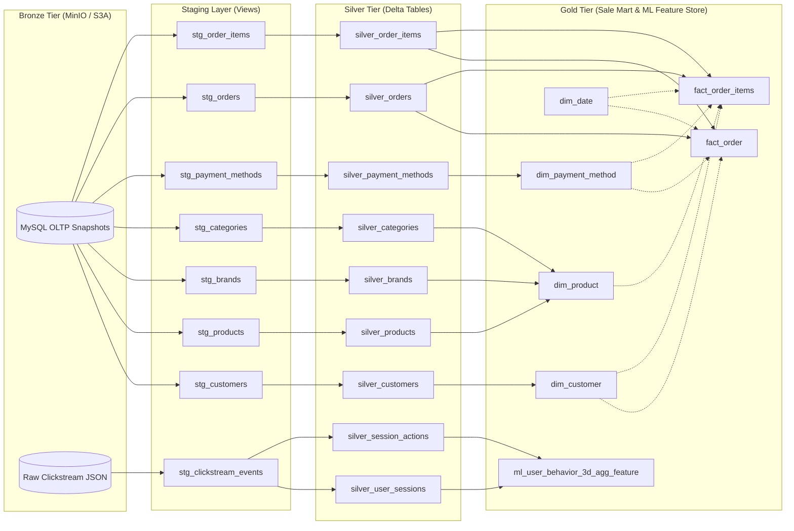

# dbt Medallion Architecture & Data Lineage Documentation

This document outlines the end-to-end data transformation pipeline orchestrated by **dbt-spark** atop **Apache Spark Thrift Server** and **Delta Lake** within the Modern E-Commerce Data Lakehouse Platform.

---

## 1. Architectural Overview

The transformation layer implements Databricks' Medallion Architecture pattern, transitioning raw data across progressive refinement tiers:



---

## 2. Medallion Transformation Tiers

### 2.1 Staging Layer (`staging.*`)
- **Materialization:** `view`
- **Purpose:** 1-to-1 lightweight abstraction over external Bronze Delta tables. Renames source fields to consistent lower snake_case conventions, casts basic data types, and applies row-level sanitization filters without modifying source grain.
- **Key Models:**
  - `stg_customers`: Cleansed customer profile views.
  - `stg_products`: Standardized product catalog records.
  - `stg_brands`, `stg_categories`, `stg_payment_methods`: Reference lookup views.
  - `stg_orders`, `stg_order_items`: Transaction headers and line items.
  - `stg_clickstream_events`: High-velocity website interaction logs.

### 2.2 Silver Layer (`silver.*`)
- **Materialization:** `table` (Delta Lake)
- **Purpose:** Cleansed, deduplicated, enriched single-source-of-truth conformed tables. Handles entity deduplication via `row_number() over (partition by ... order by updated_at desc)`, parses JSON telemetry arrays via `explode(from_json(...))`, and partitions event streams by `year/month/day`.
- **Key Models:**
  - `silver_customers`: Cleansed master customer directory with normalized email and phone.
  - `silver_products`: Curated product master with verified categories and pricing.
  - `silver_brands`, `silver_categories`, `silver_payment_methods`: Master reference tables.
  - `silver_orders`, `silver_order_items`: Conformed transactions with validated non-negative pricing.
  - `silver_user_sessions`: Flattened session engagement with device telemetry and geo coordinates.
  - `silver_session_actions`: Granular unnested actions with binary funnel interaction flags.

### 2.3 Gold Layer (`sale_mart.*` & `ml.*`)
- **Materialization:** `table` (Delta Lake)
- **Purpose:** Kimball Galaxy dimensional schema for BI analytical querying, executive KPI dashboards, and high-performance ML feature stores.
- **Sale Mart Galaxy Schema (`sale_mart.*`):**
  - `dim_customer`: Customer demographics, address geography, and loyalty tiers.
  - `dim_product`: Denormalized product dimension joined with brand and category hierarchies.
  - `dim_payment_method`: Conformed payment channel dimension with SCD Type 2 tracking.
  - `dim_date`: Continuous calendar dimension (2020–2030) with rich temporal attributes.
  - `fact_order`: Order-grain transaction fact table capturing gross sales, discounts, and net revenue.
  - `fact_order_items`: Line-item fact table linking SKU purchases directly to multidimensional keys.
- **Machine Learning Feature Store (`ml.*`):**
  - `ml_user_behavior_3d_agg_feature`: Rolling 3-day window aggregation of user behavioral features (sessions, pageviews, action breakdown, conversion ratios) and target label (`label_purchase_tomorrow`) for Spark MLlib training.

---

## 3. Data Quality & Assertion Framework

The dbt project leverages automated data quality checks executed before downstream data consumption:

### 3.1 Generic Schema Tests
- **Primary Key Uniqueness & Non-Null:** Enforced on every dimension (`customer_key`, `product_key`, `date_key`, `payment_method_id`) and fact table (`order_id`, `order_item_id`).
- **Referential Integrity (`relationships`):** Foreign keys in `fact_order` and `fact_order_items` must strictly reference valid primary keys in conformed dimension tables.
- **Accepted Values (`accepted_values`):** Binary flags (`is_weekend`, `is_weekday`, `label_purchase_tomorrow`) are constrained to `[0, 1]`.

### 3.2 Singular Business Tests
- **`assert_positive_revenue.sql`:** Queries across `fact_order` and `fact_order_items` ensuring no transaction possesses negative gross prices, negative discounts, or negative net revenue.

---

## 4. Operational Execution Commands

Run transformation workloads against Spark Thrift Server:

```bash
# Compile SQL models and validate Jinja templating
dbt compile --project-dir dbt --profiles-dir dbt

# Execute full Medallion pipeline (Staging -> Silver -> Gold)
dbt run --project-dir dbt --profiles-dir dbt

# Run all schema and data quality tests
dbt test --project-dir dbt --profiles-dir dbt

# Generate and inspect interactive dbt documentation catalog
dbt docs generate --project-dir dbt --profiles-dir dbt
dbt docs serve --port 8085
```
